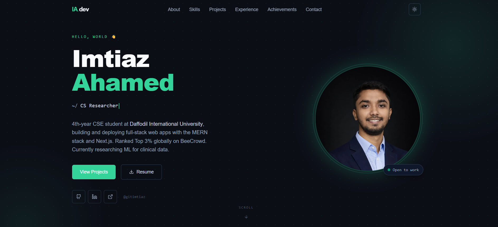

<div align="center">

  

  <h1>Imtiaz Ahamed — Portfolio</h1>

  <p>Personal portfolio website of a Junior MERN Developer & 4th-year CSE student.</p>

  [](https://imtiaz-dev-portfolio.vercel.app)
  [](https://github.com/gitimtiaz)
  [](https://www.linkedin.com/in/imtiaz-cse-ahamed/)

  <br/>

  
  
  
  
  

</div>

---

## 📸 Preview


---

## ✨ Features

- **Dark / Light mode** — dark by default, toggleable via navbar
- **Animated Hero** — typewriter role switcher with Framer Motion staggered entrance
- **Skills section** — category tabs with live icons from skillicons.dev
- **Projects showcase** — 4 live deployed projects, StudyDesk featured
- **Timeline** — experience and education in an alternating layout
- **Achievements** — BeeCrowd Top 3% globally, contest finalist cards, ML research
- **Contact form** — EmailJS powered, no backend needed
- **Custom favicon** — IA monogram SVG, works at all sizes
- **Scroll-aware navbar** — active section detection via IntersectionObserver
- **Fully responsive** — mobile-first, tested across breakpoints
- **Hidden `/admin` route** — CMS stub, planned for v2

---

## 🛠️ Built With

| Category | Technology |
|---|---|
| Framework | [Next.js 14](https://nextjs.org) (App Router) |
| Styling | [Tailwind CSS v3](https://tailwindcss.com) + CSS variables |
| Animation | [Framer Motion](https://www.framer.com/motion/) |
| Theming | [next-themes](https://github.com/pacocoursey/next-themes) |
| Icons | [Lucide React](https://lucide.dev) + [skillicons.dev](https://skillicons.dev) |
| Fonts | [Syne](https://fonts.google.com/specimen/Syne) · [Outfit](https://fonts.google.com/specimen/Outfit) · [Space Mono](https://fonts.google.com/specimen/Space+Mono) |
| Contact | [EmailJS](https://www.emailjs.com) |
| Deployment | [Vercel](https://vercel.com) |

---

## 🚀 Getting Started

### Prerequisites

- Node.js `v18+`
- npm `v9+`

### Installation

```bash
# 1. Clone the repo
git clone https://github.com/gitimtiaz/imtiaz-portfolio.git
cd imtiaz-portfolio

# 2. Install dependencies
npm install

# 3. Set up environment variables
cp .env.local.example .env.local
# Fill in your EmailJS credentials inside .env.local

# 4. Start development server
npm run dev
```

Open [http://localhost:3000](http://localhost:3000) in your browser.

### Environment Variables

```env
NEXT_PUBLIC_EMAILJS_SERVICE_ID=your_service_id
NEXT_PUBLIC_EMAILJS_TEMPLATE_ID=your_template_id
NEXT_PUBLIC_EMAILJS_PUBLIC_KEY=your_public_key
```

Get your credentials free at [emailjs.com](https://www.emailjs.com) → Dashboard → Email Services.

---

## 📁 Project Structure

```
imtiaz-portfolio/
├── public/
│   └── imtiaz.png              # Profile photo
├── src/
│   ├── app/
│   │   ├── globals.css         # Theme variables, Tailwind base, utilities
│   │   ├── icon.svg            # Custom IA monogram favicon
│   │   ├── layout.js           # Root layout with metadata + ThemeProvider
│   │   ├── page.js             # Main page — assembles all sections
│   │   └── admin/
│   │       └── page.js         # Hidden admin stub (v2 feature)
│   ├── components/
│   │   ├── layout/
│   │   │   ├── Navbar.jsx      # Sticky nav with scrollspy + mobile menu
│   │   │   └── Footer.jsx      # Social links + copyright
│   │   ├── sections/
│   │   │   ├── Hero.jsx        # Typewriter + photo + CTA
│   │   │   ├── About.jsx       # Bio + stats + education card
│   │   │   ├── Skills.jsx      # Category tabs + icon grid
│   │   │   ├── Projects.jsx    # 4 project cards
│   │   │   ├── Timeline.jsx    # Experience + education timeline
│   │   │   ├── Achievements.jsx # BeeCrowd + contests + research
│   │   │   └── Contact.jsx     # EmailJS form + contact info
│   │   └── ui/
│   │       ├── ProjectCard.jsx # Reusable project card atom
│   │       ├── SkillIcon.jsx   # Skill icon with skillicons.dev
│   │       ├── SectionWrapper.jsx # Framer Motion scroll trigger wrapper
│   │       ├── SectionHeader.jsx  # Eyebrow + title + subtitle
│   │       ├── ThemeToggle.jsx    # Sun/moon toggle button
│   │       └── ThemeProvider.jsx  # next-themes client wrapper
│   ├── data/
│   │   ├── projects.js         # All 4 projects with metadata
│   │   ├── skills.js           # Skills grouped by category
│   │   └── achievements.js     # Achievements + stats constants
│   └── lib/
│       └── motion.js           # Shared Framer Motion variants
├── .env.local.example          # Environment variable template
├── jsconfig.json               # @ path alias → src/
├── next.config.js
├── tailwind.config.js
└── package.json
```

---

## ☁️ Deployment

This portfolio is deployed on [Vercel](https://vercel.com). To deploy your own:

1. Push this repo to GitHub
2. Go to [vercel.com](https://vercel.com) → **New Project** → import `imtiaz-portfolio`
3. Add the three EmailJS environment variables in **Project Settings → Environment Variables**
4. Click **Deploy** — done

Every push to `main` triggers an automatic redeploy.

---

## 🗺️ Roadmap

- [x] Hero section with typewriter animation
- [x] Dark / light theme toggle
- [x] Skills with live icon grid
- [x] Projects section (4 live projects)
- [x] Timeline — experience & education
- [x] Achievements — BeeCrowd + research
- [x] Contact form via EmailJS
- [x] Custom SVG favicon
- [ ] Admin panel at `/admin` — add/edit projects and skills without touching code
- [ ] Backend: Express + MongoDB (same stack as StudyDesk)
- [ ] Resume PDF hosted directly (replace Google Drive link)

---

## 📬 Connect

| Platform | Link |
|---|---|
| 🌐 Portfolio | [imtiaz-dev-portfolio.vercel.app](https://imtiaz-dev-portfolio.vercel.app) |
| 💼 LinkedIn | [imtiaz-cse-ahamed](https://www.linkedin.com/in/imtiaz-cse-ahamed/) |
| 🐙 GitHub | [@gitimtiaz](https://github.com/gitimtiaz) |
| 📧 Email | [imtiazp32@gmail.com](mailto:imtiazp32@gmail.com) |
| 🏆 BeeCrowd | [Profile — Top 3% globally](https://judge.beecrowd.com/en/profile/785422) |

---

<div align="center">
  <sub>Built with ☕ and Next.js by <a href="https://github.com/gitimtiaz">Imtiaz Ahamed</a></sub>
</div>
